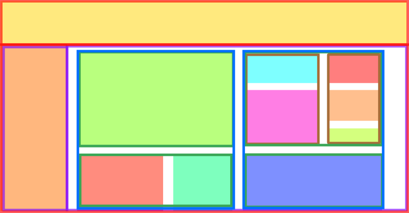

## Advanced CSS and SCSS

---

## Learning Objectives
- Gain familiarity the extra functionality provided by SCSS
- Learn tips and pitfalls that may help you in your fullstack!

---

## Agenda
- Reminders about CSS and Projects
- Flexbox Recap
- SCSS Benefits Overview
- Position Pitfalls
- Basics of Grid
- Using SCSS in Your Project
- Mixins

---

## There are always many different ways you can achieve a result with CSS
- Ex: Float vs Flex vs Grid can all achieve a similar layout
- Choose what makes the most sense to you in this project!

---

## Don't forget a reset!

---

## Naming Conventions
- Name classes in `kebab-case`
- A space in a class name means separate classes that also apply to an element 
- Select elements that have multiple specific classes by chaining WITHOUT an additional separator (like a space or `>`)

--- 

```js
    // In React JSX element
    <div className="this-is an example"></div>
```
```css
    /* Can Be Selected By: */
    .this-is, /* OR */
    .an, /* OR */
    .example {
        /* Styles here */
    }
    .this-is.example { /* Styles here */ }

    /* NOT Selected By: */
    .this-is .an { /* Styles here */ }
```
---

## Caution
- Be careful about getting overly specific with styles/selectors. Layouts may change somewhat and you don't want to have a small HTML change break your whole layout if you can avoid it!

---

## Don't Plagiarize 
- Copying styles, including from the site you are cloning, is plagarism!
- Your element structure will be different! Your styles will be too.
- There are freely available CSS Resets, but make sure you give credit if you use one!

---

## Flexbox Recap Demo

---

## What is SCSS?
- SCSS stands for "Sassy CSS", often used interchangably with "SASS"
- Technically distinct from SASS but VERY similar (SCSS is based on SASS but with more conventionally css-like syntax)
- Compiles into standard CSS before being sent to the browser
- Normal CSS works in SCSS files!
- Gives us unlimited cosmic power! ...or at least *more* power.

---

## The Powers of SCSS
- Nested selectors
- Variables
- Imports
- Mixins
- ...And more!

---

## Nesting Selectors


- SCSS lets you nest selectors to more cleanly/quickly write complex CSS rules
- SCSS compiles to CSS and it will build the full selectors
- Allows us to reduce the number of classes we need, especially with semantic html, since we can select easily through relationships between elements

---

```scss
.some-class{
    /* rule 1 */
    div { /* rule 2 */ }
    > p { /* rule 3 */ }
    &:hover { 
        /* rule 4 */
        &.another-class li { /* rule 5 */ }
    }
}
```
### COMPILES TO

```scss
.some-class { /* rule 1 */ }
.some-class div { /* rule 2 */ }
.some-class > p { /* rule 3 */ }
.some-class:hover { /* rule 4 */ }
.some-class.another-class:hover li { /* rule 5 */ }
```

---

## Caution
- Nesting **everything** can be tempting
- If you nest too deeply, your rules will be highly specific!
- Look for where you can pull out to just a basic selector, like a class selector, and start nesting over

---

## Variables
- SCSS lets us define project-wide variables for colors, fonts, sizes, etc
- Begin defining variable with `$`
- Use as the value for a property, or in a calculation
- Note: The `;` at the end of each line is necessary for SCSS to compile!
```
$some-size: 10px;
$main-color: #97a9c7;
$sans-serif: Verdana, Geneva, Tahoma, sans-serif;

body { 
    font-family: $sans-serif;
    padding: $some-size * 2;
}
```

---

## Pitfalls of Positioning:

- `z-index` doesn't work smoothly between sibling elements
- You'll have to rewrite a lot of your layout if you run into this!

---

## Problematic Positions Demo

---

## Grid

- More recent than Flexbox
- Easier to create 2 dimensional layouts
- Easier to create specific spacing (gaps) between elements

---


---



---


---

## Grid Demo

---

## Grid Vs Flex

---

## Grid:
- Better for 2D layouts
- Simple if elements line up evenly
- Clearly indicate *exactly* where you want elements to end up
- Often cleaner for responsive layouts

---

## Flex:
- Easy 1D Alignment
- Simpler styles for centering, space-between, etc
- Useful if there are irregularly sized elements/no clean rows and columns
- Helpful if we only care how elements are placed relative to each other
- Helpful for behavior like `flex-grow`/`flex-shrink`

---

## So...which should I use?

---

## BOTH
- ...or whichever you're more comfortable with
- Flex and Grid both have a place in modern css

---

## Using SCSS with Ruby on Rails
- Rails is capable of compiling SCSS by default!
- Rename `application.css` to `application.scss`
- `//= require_tree .` in the `application.scss` will now be problematic
    - We need to specify import order to define variables before we use them
    - Causes problems with SCSS on Heroku, even if working locally
- `.scss` files gain access to the `image-url`, `image-path`, `asset-url`, and `asset-path` Rails helper methods

---

## Fontawesome Icons and React

- [Fontawesome](https://fontawesome.com/) is a great resource for icons and has a React library!
- Follow instructions to 'get started'
- Make a library file and make sure it's required in a bundled file
    - Don't need to use it, just make sure it's bundled!
- Import icons in the library file, the `<FontAwesomeIcon />` component in the component you're using the icon, and you're set!

---

## SCSS Imports
- Now we have variables, we need to make sure they're defined before we use them
- Import files with `@import './some_style.scss`
- We can still import standard CSS files from our project directory
- Can also import from external sources, like [google fonts](https://fonts.google.com/)
- Differs from standard CSS `@import` in that it will compile everything into one file at build time, rather than requesting individual css files

---

## Mixins
- DRY up our styles
- Refactor frequently repeated styles into a mixin that can be used quickly and cleanly
- Can take in variables and even apply default values!

```scss
@mixin button{
    font-weight: 800;
    padding: 10px;
    font: $sans-serif;
    color: $btn-text-color;
    &:hover {
        color: $btn-hover;
    }
}
```
---

## Mixin Demo

---

## What we expect from your clone

---

## Should be "pixel perfect" 
- Should *match* the cloned website's style
- Can change font style, images, and color scheme to match your version's theme
- Don't spend time looking for images now - use the website's as placeholders and switch to non-copyrighted images while cleaning up for the job search 

--- 

## Doesn't need to be responsive...BUT:
- needs to look okay on common computer screen sizes
    - Some computers render websites at a lower resolution than the screen resolution (13" Macbook Air renders webpages at 1440x900 despite native 2560x1600)
- An over-reliance on static pixel values can make this more difficult
- Test occasionally on another screen if you have one, or a friend's computer that has a different resolution than yours!

---

## Last Note:
- Remember that copying styles is plagiarism (including from the website you're cloning)
- Add proper attribution to public domain additions (like possibly your css reset)
- Don't copy-paste from Stack Overflow
- **Good rule to go by**: if you can't recreate it from your understanding after navigating away from the page, don't use it!

---

## Good Luck! :)

---

## Resources:
- CSS:
    - [W3Schools](https://www.w3schools.com/css/)
    - [MDN Docs](https://developer.mozilla.org/en-US/docs/Web/CSS/Reference)
    - [CSS-Tricks](https://css-tricks.com/)
- Flex:
    - [MDN Guide](https://developer.mozilla.org/en-US/docs/Web/CSS/CSS_Flexible_Box_Layout/Basic_Concepts_of_Flexbox)
    - [CSSTricks Guide to Flexbox](https://css-tricks.com/snippets/css/a-guide-to-flexbox/)
    - [Flexbox Froggy](https://flexboxfroggy.com/)
- Grid: 
    - [MDN Guide](https://developer.mozilla.org/en-US/docs/Web/CSS/CSS_Grid_Layout/Basic_Concepts_of_Grid_Layout)
    - [CSSTricks Guide to Grid](https://css-tricks.com/snippets/css/complete-guide-grid/)
    - [Grid Garden](https://cssgridgarden.com/)
- SCSS:
    - [SASS Language Guide](https://sass-lang.com/guide)
    - [W3Schools Tutorial](https://www.w3schools.com/sass/)
    - [Youtube Video Tutorials](https://www.youtube.com/results?search_query=scss)
### And Trust me: you can find resources for almost any css problem/intended result with [our favorite helpdesk](www.google.com)